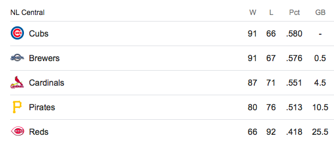
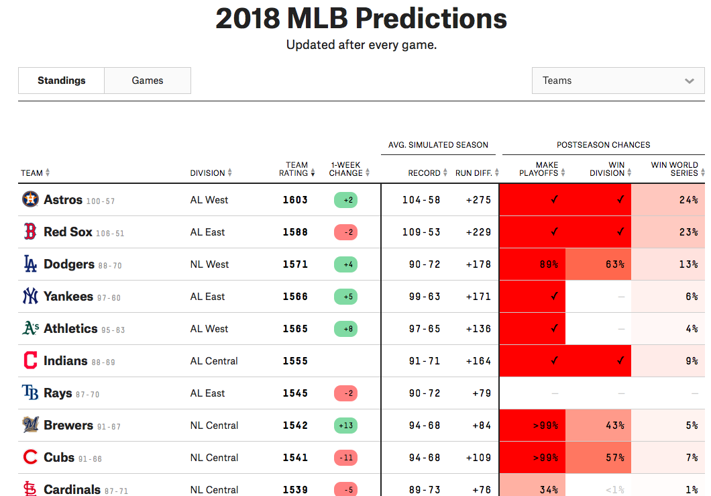

```{r setup, include=FALSE}
library(dplyr)
library(reshape2)
library(ggplot2)
library(knitr)
opts_chunk$set(echo = FALSE, warning = FALSE, message = FALSE, comment = "",
                      fig.height = 6, fig.width = 8, highlight=FALSE)
options(scipen=999) # turn of scientific notation.

```

It is the end of the 2018 regular season in MLB. The Chicago Cubs are on everybody's mind at my office, and of course it's hard for me to sympathize as a long-time Milwaukee Brewers fan living in Chicago. 
  

The dynamic right now is quite interesting. As of today, September 26, 2018, the NL Central standings looks as follows. The Cubs have a 0.5 game lead on the Brewers because they have played one less game. 
  

``` {r}

```
  

The Cubs have 5 games left to play and the Brewers have only 4. If the division standings end in a tie for first place, a 1 game playoff will be played to crown the division champion. So, **What is the probability that the Brewers will tie or steal the division title from the Cubs?** The answer to this question can be estimated by identifying how likely it is the Brewers win at least the same number of games as the Cubs. This is equivalent to the Cubs losing at least 1 more game remaining than the Brewers. 
  

We can approach this problem with a data story. Given **n** games left to play, and an underlying probability **p** of winning a game, what is the probability of any number of wins for a team, when tweaking these 2 parameters. It turns out there's a model of data called the [binomial distribution](https://en.wikipedia.org/wiki/Binomial_distribution), a counting machine we can plug values into for the Cubs and Brewers, respectively. It will then spit out probabilities for each team of winning **X** more games!   
  
  

## Analytical Approach

To solve this analytically, we apply a little math magic to count the ways in which each team's remaining season can play out in terms of wins. . . 
  

1. A function called `dbinom()` in the statistical programming language, `R`, directly calculates the [probability mass function](https://en.wikipedia.org/wiki/Probability_mass_function) of winning **X** games with **n** left to play, given **p**, the team's winning percentage.
  
``` {r echo=TRUE}
brewers_wins <- dbinom(c(0,1,2,3,4), # plausible outcomes for Brewers wins
                       size = 4, # total games left
                       p =0.576) # probability of winning a game = current win %

cubs_wins <- dbinom(c(0,1,2,3,4,5),
                    size = 5, 
                    p =0.58)
```
  

2. Apply matrix multiplication to calculate the [joint probability](http://www.statisticshowto.com/joint-probability-distribution/) of the Cubs and Brewers winning exactly **X** of their remaining games (ex. Brewers win 1 more and Cubs win 3 more). In probability theory, you multiply probability of different events/outcomes when they are assumed independent of each other. Since the Cubs and Brewers don't play any more games against each other, this is a fair assumption to make. 

``` {r}
brewers_wins_x <- matrix(brewers_wins,
                         dimnames = list(paste0("MIL_", c(0:4), "_Win"),"Brewers"))

cubs_wins_x <- matrix(cubs_wins, ncol=length(cubs_wins),
                      dimnames = list("Cubs", paste0("CHC_", c(0:5), "_Win")))
 
joint_x <- round(brewers_wins_x %*% cubs_wins_x,3)
```

After wrangling some `R` code, we can inspect the joint probability distribution of any combination of possible Cubs and Brewers wins. Note that this is a probability distribution as the values in each cell sum to 1. 

``` {r}
apply(joint_x,2,rev)
```

The plot below visualizes the above for easier interpretation of all plausible win scenarios. The asterisks are indicative of outcomes favorable to Milwaukee tying or winning the division.
  

``` {r}
melt(joint_x) %>%
    rename(brewers = Var1, cubs = Var2, joint_prob = value) %>%
    mutate(brewers = stringr::str_extract(brewers, "[[:digit:]]+"),
           cubs = stringr::str_extract(cubs, "[[:digit:]]+"),
           text = ifelse(as.integer(brewers) >= as.integer(cubs), "*", "")) %>%
    ggplot(aes(x=cubs, y=brewers, fill=joint_prob)) + 
        geom_tile(color = "white") + 
        geom_text(aes(label=text), size =10) +
        scale_fill_gradient2(low = "blue", high = "red", 
           midpoint = 0.065, limit = c(0,0.13), space = "Lab", 
           name="Joint\nProbability") +
        labs(title = "Joint Probability of Predicted Wins for Cubs & Brewers",
             x= "Plausible # of Cubs Wins",
             y= "Plausible # of Brewers Wins") +
        theme_minimal() +
        theme(plot.title = element_text(size=18),
              plot.subtitle = element_text(size=12),
              axis.title=element_text(size=12, face="bold"))

    
```
  
  

3. Sum all the joint probabilities where the Brewers won the same number of games or more than the Cubs. This is the final probability answer to our question. If we sum all the tiles with marks on them, the probability of the Brewers tying or winning the NL Central division as of 9/26/18 are **`r round(sum(joint_x[lower.tri(joint_x, diag=TRUE)]),2)`**.
  

## Simulation Approach 

Simulation is a popular alternative approach to statistical inference than what was done above (some calculus being applied under the hood with `dbinom()`), since the same probability can be estimated by just counting the ways in which many many simulated events occurred. We will simulate thousands of random draws from the Cubs' and Brewers' respective binomial distributions as previously described, where each team has parameters **n** games remaining and **p** probability of winning each game. We will then compare the simulated win totals between each team to arrive at an estimate of **What is the probability that the Brewers will steal the division title from the Cubs?**
  

```{r}
set.seed(123)
brewers_wins <- rbinom(n=10000, size=4, prob=0.576)
cubs_wins <- rbinom(n=10000, size=5, prob=0.580)

data.frame(brewers_wins, cubs_wins) %>%
    tidyr::gather(team, simulated_wins) %>%
    ggplot(aes(x=simulated_wins, y=team)) + 
        ggridges::geom_density_ridges2(aes(fill=team), stat = "binline", binwidth = 0.5, scale =0.9) +
        labs(title = "10,000 Simulations of Cubs and Brewers Remaining Wins",
             subtitle = "Using the binomial distribution as a model of the data",
         x= "Simulated Remaining Wins",
         y= NULL) +
        scale_x_continuous(limits=c(0,6), breaks = seq(0,6,1)) +
        theme_minimal() +
        scale_fill_manual(guide = FALSE, values = c("navy", "blue")) +
        theme(plot.title = element_text(size=18),
              plot.subtitle = element_text(size=12),
              axis.title=element_text(size=12, face="bold"),
              axis.text=element_text(size=14))
```
  

Given the simulated distribution of wins for each team above, the Cubs have a better chance at getting 4 or 5 wins than the Brewers. But the modes are quite similar. Each the Cubs and Brewers are predicted to most likely get between 2 to 3 wins, given their winning percentages **p** and their number of remaining games, **n**. The probability that the Brewers will steal the division title from the Cubs can be estimated by comparing each of the 10,000 pairs of simulated wins between the teams, and measuring the proportion where the Brewers win as many or more simulations than the Cubs. In `R` code:
  
``` {r echo=TRUE}
round(mean(brewers_wins >= cubs_wins), 2)
```
  
We get the same estimated probability using simulation as we do using direct analytical methods!
  

## Let's check the results against other's projections
  

Now, is this extremely simple model realistic? I'm making predictions simply based upon each team's current 2018 season win percentage and no other contexts!

Let's get a reality check on whether this arbitrarily simple model gives us a reasonable estimate compared to a much more robustly built forecasting system. We can look to Nate Silver's www.fivethirtyeight.com
and their [MLB standings projections](https://projects.fivethirtyeight.com/2018-mlb-predictions/?ex_cid=rrpromo) for comparison.
  

``` {r}

```
  
It looks like their projections as of today are similar to my simple models above at a 43% chance of the Brewers taking the division from the Cubs. 
  
## Final Thoughts
  
We went over a couple different ways to tell a data story about the chances of winning a fixed **n** number of games, given a **p** probability chance of success, using a [binomial distribution](https://en.wikipedia.org/wiki/Binomial_distribution). We applied this data story to the remaining schedule of the Cubs and Brewers seasons, respectively, using techniques of traditional statistical inference and simulation. Both gave us the same answer that the Brewers have a 47% chance to tie or win the division title.
  
If you're a Cubs fan, with the odds of tying or winning the division right now approximating a single coin flip, this weekend may call for a large bottle of Tums. 
  
I hope you enjoyed the first post. Feel free to comment below. The code underlying the analysis and graphs are available on [Github](https://github.com/BrandonHoeft/deepdishdata/tree/master/sept2018/cubs_division_odds).
  


``` {r setup2, include=FALSE, eval=FALSE}
# GIVING ME ERRORS RIGHT NOW
library(RWordPress)
# Tell RWordPress how to set the user name, password, and URL for your WordPress site.
options(WordPressLogin = c(rwilldred27 = Sys.getenv("wordpress_password")),
        WordPressURL = 'https://deepdishdata.com/xmlrpc.php')

# Tell knitr to create the html code and upload it to your WordPress site
knit2wp("who_is_winning_the_nl_central.Rmd", 
        title = 'September 2018 Post', 
        publish = FALSE)
```