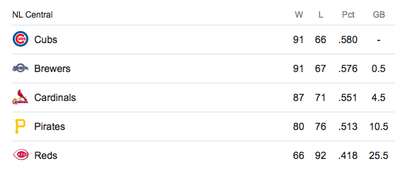

Who is winning the NL Central this Weekend!?
================
Brandon Hoeft
9/26/2018

-   [Analytical Approach](#analytical-approach)
-   [Simulation Approach](#simulation-approach)
-   [Let's check against someone much smarter than me](#lets-check-against-someone-much-smarter-than-me)
-   [R Markdown](#r-markdown)

It is the end of the 2018 regular season in MLB. The Chicago Cubs are on everybody's mind at my office, and of course it's hard for me to sympathize as a long-time Milwaukee Brewers fan.

The dynamic right now is quite interesting. As of today, September 26, 2018, the NL Central standings looks as follows. The Cubs have a 0.5 game lead on the Brewers because they have played one less game.



The Cubbies have 5 games left to play and the Brewers have only 4. The team with the most wins will win the division. If the division standings end in a tie for first place, a 1 game playoff will be played to crown the division champion. So, **What is the probability that the Brewers will steal the division title from the Cubs?** The answer to this question can be estimated by identifying how likely it is the Brewers win at least the same number of games as the Cubs. This is equivalent to the Cubs losing at least 1 more game remaining than the Brewers.

To approach this problem, I used a data model called the [binomial distribution](https://en.wikipedia.org/wiki/Binomial_distribution). In our use case, given **n** games left to play, and an underlying probability **p** of winning a game, this counting machine can measure the probability of any number of wins for a team using these 2 parameters/assumptions.

We'll apply this data model for each the Cubs and the Brewers probability of winning **X** more games and make some inference from the outputs.

Analytical Approach
-------------------

To solve this analytically, we apply a little math magic to count the ways in which each team's remaining season can play out in terms of wins. . .

1.  I will use a function called `dbinom()` in the statistical programming language, `R`, to calculate the probability of winning **X** games with **n** left to play, given **p**, the team's winning percentage.

``` r
brewers_wins <- dbinom(c(0,1,2,3,4), # plausible outcomes for Brewers wins
                       size = 4, # total games left
                       p =0.576) # probability of winning a game = current win %

cubs_wins <- dbinom(c(0,1,2,3,4,5),
                    size = 5, 
                    p =0.58)
```

1.  Then apply matrix multiplication to calculate the [joint probability](http://www.statisticshowto.com/joint-probability-distribution/) of the Cubs and Brewers winning exactly **X** of their remaining games (ex. Brewers win 1 more and Cubs win 3 more). In probability theory, you multiply probability of different events/outcomes when they are assumed independent of each other. Since the Cubs and Brewers don't play any more games against each other, this is a fair assumption to make. The plot below visualizes the joint probability distribution.


1.  Sum all the joint probabilities where the Brewers won the same number of games or more than the Cubs. This is the final probability answer to our question. If we sum all the tiles with marks on them, the probability of the Brewers tying or winning the NL Central division as of 9/26/18 are **0.47**.

Simulation Approach
-------------------

Let's check against someone much smarter than me
------------------------------------------------

Let's get a reality check on whether this math checks out. We can look to Nate Silver's www.fivethirtyeight.com and their [MLB standings projections](https://projects.fivethirtyeight.com/2018-mlb-predictions/?ex_cid=rrpromo) for comparison.


To do this, we

This weekend is going to be very angsty for a lot of baseball fans. Since probability is an interest of mine, as well as an underlying theme of this blog, I started doing a back of the envelope calculation of \*\*What is the probability

R Markdown
----------
