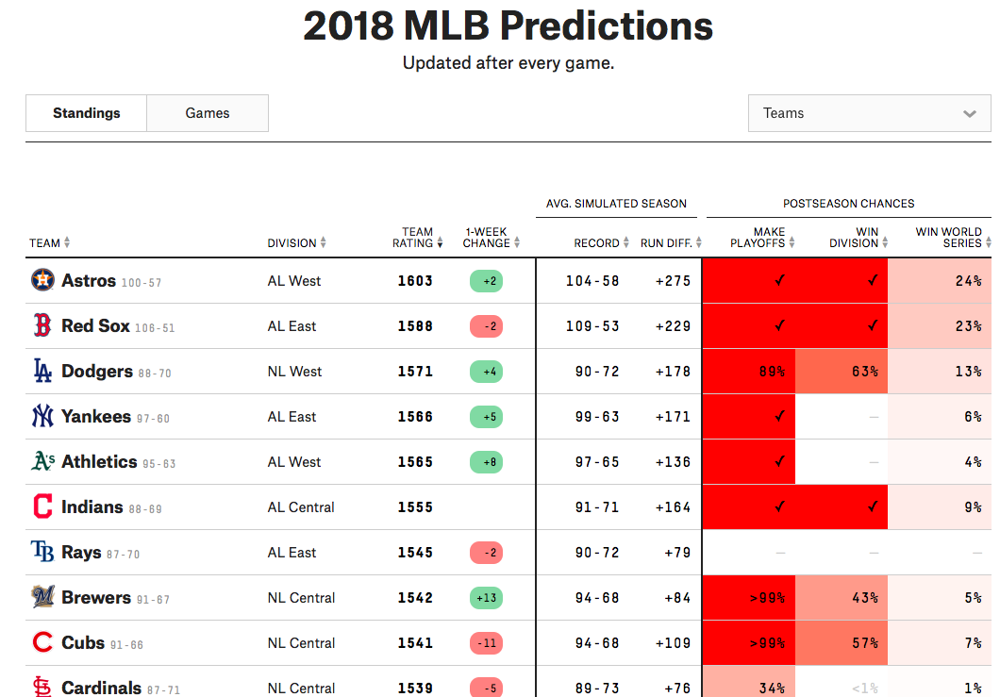

Who is winning the NL Central this Weekend!?
================
Brandon Hoeft
9/26/2018

-   [Analytical Approach](#analytical-approach)
-   [Simulation Approach](#simulation-approach)
-   [Let's check against someone much smarter than me](#lets-check-against-someone-much-smarter-than-me)
-   [R Markdown](#r-markdown)

It is the end of the 2018 regular season in MLB. The Chicago Cubs are on everybody's mind at my office, and of course it's hard for me to sympathize as a long-time Milwaukee Brewers fan.

The dynamic right now is quite interesting. As of today, September 26, 2018, the NL Central standings looks like this:

**INSERT PICTURE OF STANDINGS**

The Cubbies have 5 games left to play and the Brewers have only 4. The team with the most wins will win the division. If the division standings end in a tie for first place, a 1 game playoff will be played to crown the champion and that team avoids the cruel arbitrary nature of partaking in the single NL wild-card game. So, **What is the probability that the Chicago Cubs will still win the division?**

To approach this problem, I will model the complex underlying nature of winning a baseball game with a very "small world model". That model entails using a mathematical function called the [binomial distribution](https://en.wikipedia.org/wiki/Binomial_distribution). Binomial distributions are commonly used in teaching probability of binary event outcomes, like "Heads" or "Tails" of a coin flip. In our use case, given **n** games left to play, and an underlying probability, **p**, of success (probability of winning a game), we can measure the likelihood of any number of Wins using these 2 parameters.

Analytical Approach
-------------------

Simulation Approach
-------------------

Let's check against someone much smarter than me
------------------------------------------------

Let's get a reality check on whether this math checks out. We can look to Nate Silver's www.fivethirtyeight.com and their [MLB standings projections](https://projects.fivethirtyeight.com/2018-mlb-predictions/?ex_cid=rrpromo) for comparison.

``` r
#

```


To do this, we

This weekend is going to be very angsty for a lot of baseball fans. Since probability is an interest of mine, as well as an underlying theme of this blog, I started doing a back of the envelope calculation of \*\*What is the probability

R Markdown
----------
